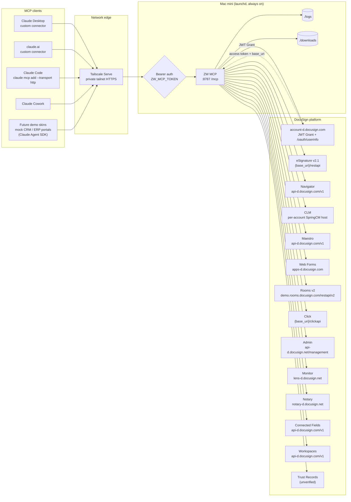
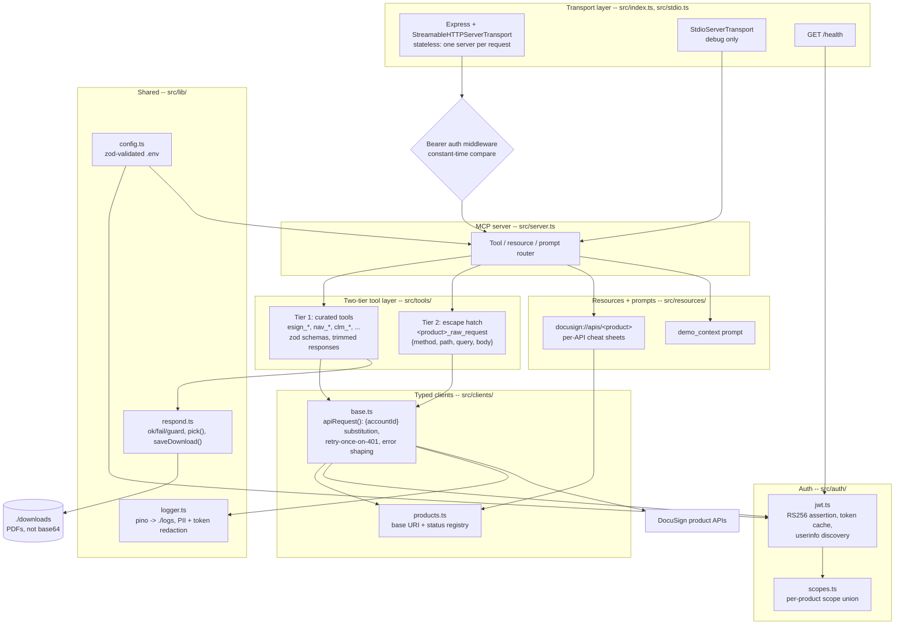
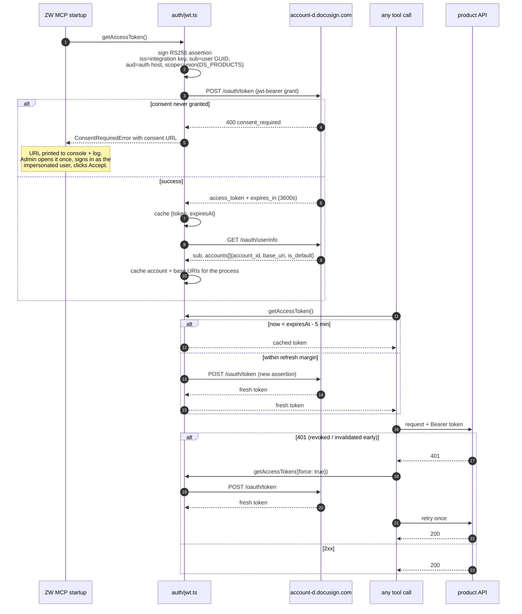

# ZW MCP -- Architecture

ZW MCP is a single always-on MCP server on a Mac mini that exposes the **whole
DocuSign platform** -- every product API, not just eSignature -- to any MCP client:
Claude Desktop, claude.ai, Claude Code, Claude Cowork, and the skinned demo UIs
that will front it later.

- **Transport**: Streamable HTTP (primary), stdio (local debugging only)
- **Endpoint**: `POST/GET /mcp`, bearer-authenticated
- **Health**: `GET /health`, unauthenticated, reports token expiry and per-product reachability
- **DocuSign auth**: OAuth 2.0 JWT Grant with user impersonation

---

## 1. System context

Everything crossing the network edge is HTTPS over the tailnet, and everything
reaching `/mcp` carries `Authorization: Bearer <ZW_MCP_TOKEN>`. The server binds
`127.0.0.1` -- Tailscale, not the OS firewall, is what decides who can reach it.

---

## 2. Internal components

---

## 3. Auth sequence

Concurrent callers never stampede the token endpoint: an in-flight mint is shared
by every waiter (`inFlight` in `auth/jwt.ts`), so ten parallel tool calls on a
cold cache produce exactly one `/oauth/token` request.

---

## 4. How a request travels

1. A client POSTs a JSON-RPC message to `https://<tailnet-host>/mcp`.
2. Express parses it; the bearer middleware compares `Authorization` against
   `ZW_MCP_TOKEN` in constant time. No token, wrong token -> `401`, logged with
   the source IP, nothing downstream is touched.
3. A **fresh `McpServer` and transport are built for that one request**. This is
   deliberate: the server is always-on and multi-client, so statelessness means a
   restart never orphans a client session and two concurrent requests can never
   collide on JSON-RPC ids. It is cheap because every expensive thing -- the
   access token, the account, the resolved base URIs -- lives in module-level
   caches shared by all instances.
4. The router dispatches to a curated tool or a `raw_request` tool. Zod validates
   the arguments before any network call.
5. The tool calls `apiRequest(product, {...})`, which resolves that product's base
   URI, substitutes `{accountId}`, attaches a valid token, and sends the request.
   A `401` triggers exactly one retry with a freshly minted token.
6. The response is trimmed to a projection (unless `verbose: true`) and returned.
   Binary payloads are written to `./downloads` and the tool returns the path.
7. Every DocuSign call is logged to `./logs/zw-mcp.log` with method, path, status
   and duration -- tokens and PII redacted by key name.

## 5. Why two tiers

DocuSign's product APIs total well over a thousand endpoints. Generating one MCP
tool per endpoint would produce a tool list no client can render and no model can
choose from -- and it would bury the fifteen calls a demo actually makes.

- **Tier 1, curated tools** are hand-written for the operations demos use. They
  have descriptions aimed at a model ("use this to answer *who has not signed
  yet*"), sensible defaults, and trimmed responses. `esign_list_envelopes`
  returns nine fields per envelope instead of a 200 KB blob.
- **Tier 2, `<product>_raw_request`** guarantees completeness. Anything not
  curated is still one call away: `{ method, path, query, body }` against that
  product's correct base URI, with auth and `{accountId}` handled. Coverage is
  100% from day one; curation is an ergonomics layer on top, not a gate.

New demand for an endpoint gets served immediately through Tier 2, and promoted
into Tier 1 when it turns out to be a repeat customer.

## 6. Demo vs production

`DS_ENVIRONMENT=demo|prod` is the only switch. It selects the auth host
(`account-d` vs `account`) and feeds every entry in `src/clients/products.ts`.

Production eSignature and Click live on account-specific hosts
(`{server}.docusign.net`, where `{server}` is the data center: NA2, EU, CA...).
Those are never hardcoded -- they come from the `base_uri` that `/oauth/userinfo`
returns for the account, cached once at startup. Flipping to prod therefore needs
no code change and no data-center lookup: point at a prod integration key and the
right hosts fall out of discovery.

## 7. How future demo skins plug in

The skinned demo UIs -- a mock CRM for the sales story, a mock ERP/procurement
portal for the Woodward-Victor supplier story -- are separate lightweight web apps
built on the **Claude Agent SDK** with ZW MCP registered as an MCP server. They
hold zero DocuSign logic: no integration key, no JWT, no base URIs. They send a
bearer token and speak MCP.

That keeps one copy of the DocuSign surface. A fix to envelope handling lands in
ZW MCP and every skin gets it. ZW MCP itself stays UI-free.

---

## 8. Per-product coverage

Status as of Phase 1, verified against the Woodward Systems demo account
(`b99e0abc-…`, org `4773242b-…`, base URI `https://demo.docusign.net`). Base URIs and scopes are transcribed from the verified
tables in [`specs/BASE_PATHS.md`](../specs/BASE_PATHS.md).

| API | Base URI (demo) | Scopes | Curated tools | Raw hatch | Spec source | Status |
| --- | --- | --- | ---: | :---: | --- | --- |
| eSignature v2.1 | `{base_uri}/restapi` | `signature` | 13 | ✅ | vendored OpenAPI | GA -- **Phase 1 verified live** |
| Navigator | `api-d.docusign.com/v1` | `adm_store_unified_repo_read`, `models_read` | 0 | ✅ | vendored OpenAPI 3.1 | beta -- Phase 2 |
| CLM | per-account SpringCM host | `spring_read`, `spring_write`, `content` | 0 | ✅ | hand-built (no published spec) | Phase 2, host discovery unverified |
| Maestro (= Workflow Builder) | `api-d.docusign.com/v1` | `aow_manage` | 0 | ✅ | vendored OpenAPI 3.1 | beta -- Phase 2 |
| Web Forms | `apps-d.docusign.com/api/webforms` | `webforms_read`, `webforms_instance_read/write` | 0 | ✅ | vendored OpenAPI | GA -- Phase 3 |
| Rooms v2 | `demo.rooms.docusign.com/restapi` | `dtr.*`, `room_forms` | 0 | ✅ | vendored OpenAPI | GA -- Phase 3 |
| Click | `{base_uri}/clickapi` | `click.manage`, `click.send` | 0 | ✅ | vendored OpenAPI | GA -- Phase 3 |
| Admin | `api-d.docusign.net/management` | `organization_read`, `user_read`, ... | 0 | ✅ | vendored OpenAPI | GA -- Phase 3 |
| Monitor | `lens-d.docusign.net/api/v2.0/datasets/monitor` | `signature` (unverified) | 0 | ✅ | vendored OpenAPI | Phase 3 -- spec and docs disagree on host |
| Notary | `notary-d.docusign.net` | `notary_read`, `notary_write` | 0 | ✅ | hand-built (no published spec) | GA -- Phase 3 |
| Connected Fields | `api-d.docusign.com/v1` | `adm_store_unified_repo_read` + `signature` | 0 | ✅ | vendored OpenAPI 3.1 | GA -- Phase 3 |
| Workspaces | `api-d.docusign.com/v1` | `dtr.rooms.*`, `dtr.documents.write` | 0 | ✅ | vendored OpenAPI 3.0 | beta -- Phase 3 |
| Trust Records | unverified | unverified | 0 | ✅ | none published | Phase 3 -- confirm the API exists as a separate surface |

"Raw hatch ✅" means the product gets a `<product>_raw_request` tool as soon as it
is listed in `DS_PRODUCTS`, regardless of curated coverage.

> Update this file at the end of every phase. The diagrams above are the contract;
> if the code stops matching them, the code or the diagram is wrong.
