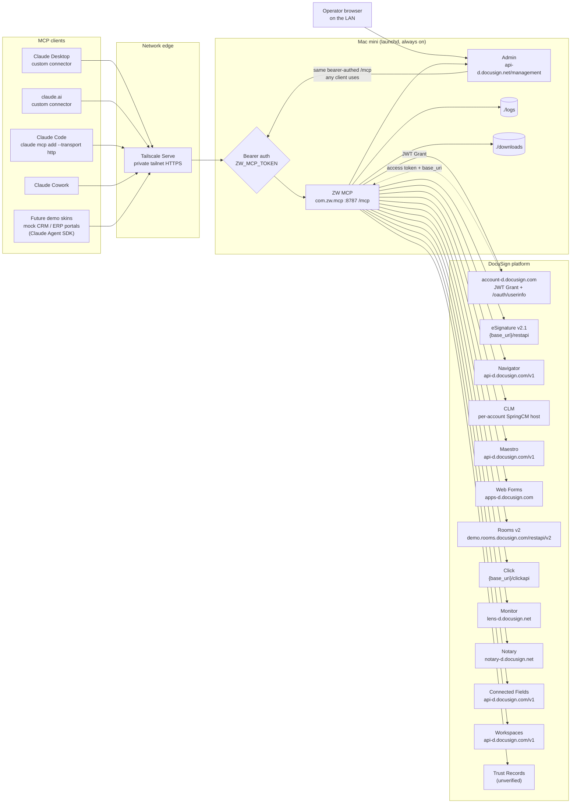
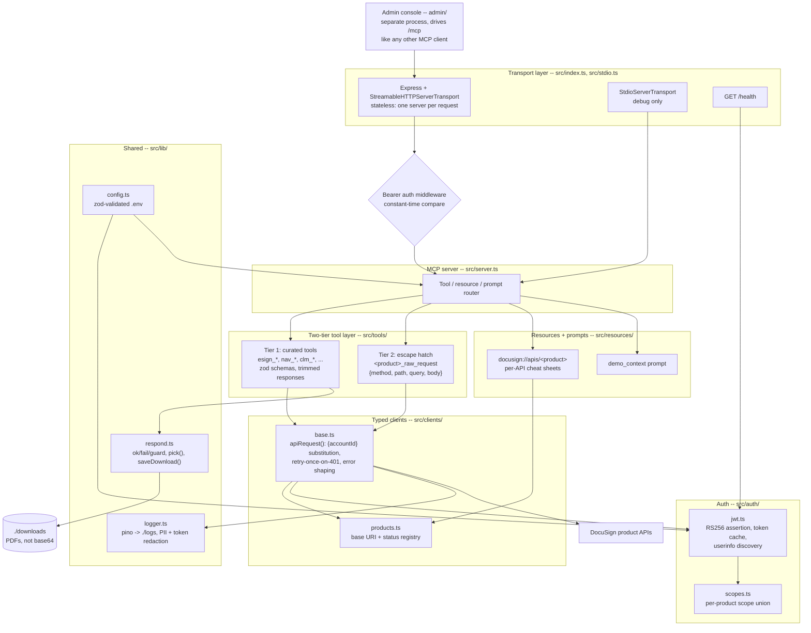
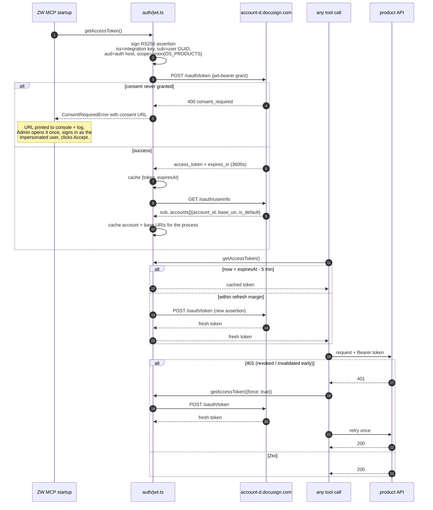

# ZW MCP -- Architecture

ZW MCP is a single always-on MCP server on a Mac mini that exposes the **whole
DocuSign platform** -- every product API, not just eSignature -- to any MCP client:
Claude Desktop, claude.ai, Claude Code, Claude Cowork, and the skinned demo UIs
that will front it later.

- **Transport**: Streamable HTTP (primary), stdio (local debugging only)
- **Endpoint**: `POST/GET /mcp`, bearer-authenticated
- **Health**: `GET /health`, unauthenticated, reports token expiry and per-product reachability
- **DocuSign auth**: OAuth 2.0 JWT Grant with user impersonation

---

## 1. System context

Everything crossing the network edge is HTTPS over the tailnet, and everything
reaching `/mcp` carries `Authorization: Bearer <ZW_MCP_TOKEN>`. The server binds
`127.0.0.1` -- Tailscale, not the OS firewall, is what decides who can reach it.

---

## 2. Internal components

---

## 3. Auth sequence

Concurrent callers never stampede the token endpoint: an in-flight mint is shared
by every waiter (`inFlight` in `auth/jwt.ts`), so ten parallel tool calls on a
cold cache produce exactly one `/oauth/token` request.

---

## 4. How a request travels

1. A client POSTs a JSON-RPC message to `https://<tailnet-host>/mcp`.
2. Express parses it; the bearer middleware compares `Authorization` against
   `ZW_MCP_TOKEN` in constant time. No token, wrong token -> `401`, logged with
   the source IP, nothing downstream is touched.
3. A **fresh `McpServer` and transport are built for that one request**. This is
   deliberate: the server is always-on and multi-client, so statelessness means a
   restart never orphans a client session and two concurrent requests can never
   collide on JSON-RPC ids. It is cheap because every expensive thing -- the
   access token, the account, the resolved base URIs -- lives in module-level
   caches shared by all instances.
4. The router dispatches to a curated tool or a `raw_request` tool. Zod validates
   the arguments before any network call.
5. The tool calls `apiRequest(product, {...})`, which resolves that product's base
   URI, substitutes `{accountId}`, attaches a valid token, and sends the request.
   A `401` triggers exactly one retry with a freshly minted token.
6. The response is trimmed to a projection (unless `verbose: true`) and returned.
   Binary payloads are written to `./downloads` and the tool returns the path.
7. Every DocuSign call is logged to `./logs/zw-mcp.log` with method, path, status
   and duration -- tokens and PII redacted by key name.

## 5. Why two tiers

DocuSign's product APIs total well over a thousand endpoints. Generating one MCP
tool per endpoint would produce a tool list no client can render and no model can
choose from -- and it would bury the fifteen calls a demo actually makes.

- **Tier 1, curated tools** are hand-written for the operations demos use. They
  have descriptions aimed at a model ("use this to answer *who has not signed
  yet*"), sensible defaults, and trimmed responses. `esign_list_envelopes`
  returns nine fields per envelope instead of a 200 KB blob.
- **Tier 2, `<product>_raw_request`** guarantees completeness. Anything not
  curated is still one call away: `{ method, path, query, body }` against that
  product's correct base URI, with auth and `{accountId}` handled. Coverage is
  100% from day one; curation is an ergonomics layer on top, not a gate.

New demand for an endpoint gets served immediately through Tier 2, and promoted
into Tier 1 when it turns out to be a repeat customer.

## 6. Demo vs production

`DS_ENVIRONMENT=demo|prod` is the only switch. It selects the auth host
(`account-d` vs `account`) and feeds every entry in `src/clients/products.ts`.

Production eSignature and Click live on account-specific hosts
(`{server}.docusign.net`, where `{server}` is the data center: NA2, EU, CA...).
Those are never hardcoded -- they come from the `base_uri` that `/oauth/userinfo`
returns for the account, cached once at startup. Flipping to prod therefore needs
no code change and no data-center lookup: point at a prod integration key and the
right hosts fall out of discovery.

## 7. How future demo skins plug in

The skinned demo UIs -- a mock CRM for the sales story, a mock ERP/procurement
portal for the Woodward-Victor supplier story -- are separate lightweight web apps
built on the **Claude Agent SDK** with ZW MCP registered as an MCP server. They
hold zero DocuSign logic: no integration key, no JWT, no base URIs. They send a
bearer token and speak MCP.

That keeps one copy of the DocuSign surface. A fix to envelope handling lands in
ZW MCP and every skin gets it. ZW MCP itself stays UI-free.

---

## 8. Per-product coverage

**84 tools across 12 products.** Status as of Phase 4, verified against the Woodward Systems demo account
(`b99e0abc-…`, org `4773242b-…`, base URI `https://demo.docusign.net`). Base URIs and scopes are transcribed from the verified
tables in [`specs/BASE_PATHS.md`](../specs/BASE_PATHS.md).

| API | Base URI (demo) | Scopes | Curated tools | Raw hatch | Spec source | Status |
| --- | --- | --- | ---: | :---: | --- | --- |
| eSignature v2.1 | `{base_uri}/restapi` | `signature` | 13 | ✅ | vendored OpenAPI | GA -- **verified live** |
| Navigator | `api-d.docusign.com/v1` | `adm_store_unified_repo_read` | 5 | ✅ | vendored OpenAPI 3.1 | beta -- **verified live** |
| CLM | discovered per account (`apiuatna11.springcm.com`) | `spring_read`, `spring_write`, `content` | 13 | ✅ | hand-built from CLM swagger | GA -- **verified live** |
| Maestro (= Workflow Builder) | `api-d.docusign.com/v1` | `aow_manage` | 8 | ✅ | vendored OpenAPI 3.1 | beta -- **verified live** |
| Web Forms | `apps-d.docusign.com/api/webforms` | `webforms_read`, `webforms_instance_read/write` | 4 | ✅ | vendored OpenAPI | GA -- **verified live** |
| Rooms v2 | `demo.rooms.docusign.com/restapi` | `dtr.*`, `room_forms` | 7 | ✅ | vendored OpenAPI | GA -- **verified live** |
| Click | `{base_uri}/clickapi` | `click.manage`, `click.send` | 5 | ✅ | vendored OpenAPI | GA -- **verified live** |
| Admin | `api-d.docusign.net/management` | `organization_read`, `user_read`, ... | 5 | ✅ | vendored OpenAPI | GA -- **verified live** |
| Monitor | `api-d.docusign.com/v1` (org-scoped) | `signature` | 1 | ✅ | vendored OpenAPI | GA -- **endpoint verified; org lacks entitlement** |
| Notary | `notary-d.docusign.net/restapi` | `notary_read/write` + `organization_read` + `signature` | 3 | ✅ | hand-built (no published spec) | GA -- **verified live (pool empty)** |
| Connected Fields | `api-d.docusign.com/v1` | `adm_store_unified_repo_read` + `signature` | 1 | ✅ | vendored OpenAPI 3.1 | GA -- **verified live** |
| Workspaces | `api-d.docusign.com/v1` | `dtr.rooms.*`, `dtr.documents.write` | 7 | ✅ | vendored OpenAPI 3.0 | beta -- **verified live** |
| ~~Trust Records~~ | — | — | 0 | — | none published | **Does not exist as a public API** (6 candidate paths 404, no docs). Off by default. |

"Raw hatch ✅" means the product gets a `<product>_raw_request` tool as soon as it
is listed in `DS_PRODUCTS`, regardless of curated coverage.

### Phase 2 notes

**`models_read` is deliberately excluded from the Navigator scope set.** The docs
recommend requesting it for forward-compatibility, but the demo account cannot
consent to it, and because a consent grant is all-or-nothing its presence made
every Navigator call fail with `consent_required`. `npm run scopecheck` probes
each scope individually and is the fastest way to find such a scope.

**CLM works in UAT and is verified live.** The docs banner "only available for CLM
customers with a production account" describes *entitlement*, not environment -- a
CLM-provisioned account works in UAT. An initial `401 Access Denied` from discovery
was purely a missing scope: `consent_required` on `spring_read`/`spring_write` means
*not yet consented*, not *not entitled*, and reading it as the latter was wrong.

CLM is the one product that does not use the shared client. Its hosts are
data-center specific and discovered at runtime, and differ per surface (Object and
Task share `ApiBaseUrl`; upload and download each get their own). Its paths also
carry a `/{version}/{accountId}` prefix, version `v2`. Because of that,
`clm_raw_request` is routed through the CLM dispatcher rather than the shared one
-- otherwise the escape hatch would silently target the wrong URL.

See `specs/BASE_PATHS.md` for the full CLM section: discovery response keys, the
path corrections over Docusign's SOAP-migration table, `Uid`-not-`Id`, the
`pageSortParams.*` collection convention, and capitalised `expand` values.

**One CLM gap remains open.** `POST /documentsearchtasks` rejects every request
body shape tried with `422 "No valid search parameters were found"`, and neither
the swagger nor the Developer Center publishes its schema. `clm_search_documents`
therefore does a name search over the folder tree using documented collection
filtering, and its tool description says so plainly rather than implying
full-text coverage it does not have.

**Live-vs-spec divergences, all caught by calling the API:**

1. Maestro's OpenAPI models a workflow instance as
   `instance_name` / `instance_state` / `workflow_id`. The live API returns
   `name` / `workflow_status` / `template_id`. Projecting on the spec's names
   returned near-empty objects.
2. Navigator sorts and filters on different names for the same field: filtering
   uses `provisions.expiration_date`, sorting uses `expiration_date`. Sorting by
   the filter name returns a 400 that helpfully lists the legal sort fields.
3. CLM's SOAP-migration table gives `GET /folders?path=`; the real route is
   `GET /folders/path?path=` (`/folders` accepts only POST, so the documented
   form returns 405).

**A caveat on `npm run scopecheck`:** DocuSign silently ignores unknown scopes --
a made-up scope string returns a token just as happily as a real one. So a ✅ does
not prove a scope is real or effective; only `consent_required` proves a scope is
recognised. The tool is reliable in the negative direction only.

### Phase 3 notes

**Four projection bugs, all found by calling the API rather than reading the spec.**
Each returned a valid-looking object with the useful fields missing, so none would
have thrown:

1. Admin lists users at `/v2/organizations/{org}/users` (the spec's
   `/v2.1/.../users/dsprofile` 404s for the list form) and **requires
   `account_id`** -- without it, 400. It also answers in snake_case.
2. Web Forms nests the form name under `formProperties.name`.
3. Workspaces answers in snake_case, and its upload-requests endpoint wraps
   results in `data` while every sibling uses a named key.
4. Maestro instances use `name`/`workflow_status`/`template_id`, not the spec's
   `instance_name`/`instance_state`/`workflow_id`.

**Monitor's host was settled by probe, not by reading.** The docs base-path table
and the vendored spec disagreed. `api-d.docusign.com/v1/organizations/{orgId}/stream`
returns a Monitor-specific `403 "Organization does not have Monitor entitlement"`
-- it routed and evaluated entitlement -- while the docs' `lens-d` host returns a
bare 403. The spec is right; this organization simply lacks the entitlement, which
no code change will fix.

**Two documented scopes are inert on this account.** `models_read` (Navigator) and
`content` (CLM) both appear in Docusign's scopes reference, but neither is ever
granted here: requesting 29 scopes returns 28. Both are excluded, and Navigator and
CLM work without them. Including `models_read` originally broke Navigator entirely,
since a consent grant is all-or-nothing.

### Phase 4 notes

**The admin console is a separate process on purpose.** ZW MCP stays UI-free, and
the console reaches it over the same bearer-authed `/mcp` endpoint that Claude
Desktop or claude.ai uses -- so it doubles as an end-to-end integration check:
anything the console can drive, a real client can drive. The bearer token lives in
the console's server process and never reaches the browser.

The console **fails closed**: binding it off-loopback without `ADMIN_PASSWORD`
refuses to start unless `ADMIN_ALLOW_INSECURE=1` is set explicitly. It currently
runs LAN-bound with that flag, which is a deliberate choice for a demo account --
the console can send and void envelopes, so that trade should be revisited before
this ever points at production.

> Update this file at the end of every phase. The diagrams above are the contract;
> if the code stops matching them, the code or the diagram is wrong.
